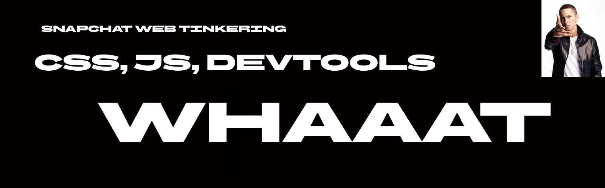

<p align="center">
  
</p>

# Snapchat Web Tinkering

A collection of client-side CSS and JavaScript experiments for Snapchat Web.

This started as me messing around with DevTools and seeing what I could change in Snapchat's UI without modifying Snapchat itself.

> **Note:** These experiments are client-side. Snapchat can change its website at any time, so selectors and CSS variables may stop working.

---

# Getting Started

Open [Snapchat Web](https://web.snapchat.com/) and open your browser's Developer Tools.

For JavaScript experiments:

1. Open the **Console** tab.
2. Paste the code.
3. Press **Enter**.
4. Return to Snapchat.

For CSS experiments, you can either use the **Elements** tab or paste CSS through whatever browser-side method you're using.

Most changes made directly through DevTools are temporary and disappear after refreshing the page.

---

# Experiment 1: True Black Theme

Snapchat's dark theme isn't completely black.

Snapchat Web uses CSS variables to control many of its colors. Some useful variables include:

```css
--sigMain
--sigSurface
--sigBackgroundPrimary
--sigBackgroundSecondary
--sigTextPrimary
--sigTextSecondary
```

You can override several of them to create a much darker theme.

```css
document.documentElement.style.setProperty("--sigMain", "#000000", "important");
document.documentElement.style.setProperty("--sigSurface", "#000000", "important");

document.documentElement.style.setProperty("--sigTextPrimary", "#ffffff", "important");
document.documentElement.style.setProperty("--sigTextSecondary", "#ffffff", "important");
document.documentElement.style.setProperty("--sigTextTertiary", "#ffffff", "important");
document.documentElement.style.setProperty("--sigTextPlaceholder", "#ffffff", "important");

document.documentElement.style.setProperty("--sigBackgroundPrimary", "#000000", "important");
document.documentElement.style.setProperty("--sigBackgroundSecondary", "#000000", "important");
document.documentElement.style.setProperty("--sigBackgroundFeedHover", "#111111", "important");
document.documentElement.style.setProperty("--sigBackgroundMessageHover", "#111111", "important");
document.documentElement.style.setProperty("--sigBackgroundMessageSaved", "#111111", "important");

document.documentElement.style.backgroundColor = "#000000";
document.body.style.backgroundColor = "#000000";
document.body.style.color = "#ffffff";
```

The exact result can depend on which Snapchat theme is currently active.

---

# Experiment 2: Change the Friends Feed

One of the useful discoveries from inspecting Snapchat Web was that the Friends area uses `--sigSurface`.

Try:

```js
document.documentElement.style.setProperty(
    "--sigSurface",
    "red",
    "important"
);
```

If the relevant UI is using that variable, its surface will change to red.

You can replace `red` with another CSS color or a HEX value.

For example:

```js
document.documentElement.style.setProperty(
    "--sigSurface",
    "#000000",
    "important"
);
```

---

# Experiment 3: Solid Camera Background

The camera background uses an image element.

The element found during testing was:

```js
document.querySelector(
    "#root > div.Fpg8t > div.Vbjsg.WJjwl > div > div > div > img"
);
```

First, hide the original image:

```js
const img = document.querySelector(
    "#root > div.Fpg8t > div.Vbjsg.WJjwl > div > div > div > img"
);

img.style.opacity = "0";
```

Then change its parent's background:

```js
img.parentElement.style.background = "#000000";
```

You can replace `#000000` with any color.

For example:

```js
img.parentElement.style.background = "#ff0000";
```

---

# Experiment 4: Custom Camera Background

You can also use an image stored on your computer.

This version opens a file picker.

```js
const selector =
    "#root > div.Fpg8t > div.Vbjsg.WJjwl > div > div > div > img";

const input = document.createElement("input");
input.type = "file";
input.accept = "image/*";

input.onchange = () => {
    const file = input.files[0];
    if (!file) return;

    const reader = new FileReader();

    reader.onload = () => {
        const img = document.querySelector(selector);
        if (!img) return;

        img.style.opacity = "0";

        const parent = img.parentElement;

        parent.style.backgroundImage = `url("${reader.result}")`;
        parent.style.backgroundSize = "cover";
        parent.style.backgroundPosition = "center";
        parent.style.backgroundRepeat = "no-repeat";
    };

    reader.readAsDataURL(file);
};

input.click();
```

After running it, choose an image from your computer.

GIFs can also be selected because the file picker accepts images.

---

# Experiment 5: Persistent Camera Background

There is one problem with the previous experiment.

If you leave the camera and come back, Snapchat may recreate the camera elements.

Because the old `` element was destroyed, the modification disappears.

A `MutationObserver` can watch the page for changes and reapply the background.

```js
const selector =
    "#root > div.Fpg8t > div.Vbjsg.WJjwl > div > div > div > img";

const input = document.createElement("input");
input.type = "file";
input.accept = "image/*";

input.onchange = () => {
    const file = input.files[0];
    if (!file) return;

    const reader = new FileReader();

    reader.onload = () => {
        const imageData = reader.result;

        const applyBackground = () => {
            const img = document.querySelector(selector);
            if (!img) return;

            img.style.opacity = "0";

            const parent = img.parentElement;

            parent.style.backgroundImage =
                `url("${imageData}")`;

            parent.style.backgroundSize = "cover";
            parent.style.backgroundPosition = "center";
            parent.style.backgroundRepeat = "no-repeat";
        };

        applyBackground();

        new MutationObserver(applyBackground).observe(
            document.body,
            {
                childList: true,
                subtree: true
            }
        );
    };

    reader.readAsDataURL(file);
};

input.click();
```

This allows the custom background to be reapplied when Snapchat recreates the camera UI.

---

# How the Camera Experiment Works

The camera background is an actual `` element.

The selector:

```js
const img = document.querySelector(
    "#root > div.Fpg8t > div.Vbjsg.WJjwl > div > div > div > img"
);
```

finds that element.

Instead of replacing the image, the experiment:

1. Finds the image.
2. Makes the image invisible.
3. Finds its parent element.
4. Gives the parent a new background.
5. Uses `background-size: cover` so the replacement fills the area.

This was useful because directly changing the image's `src` didn't produce the desired result during testing, while modifying the parent background did.

---

# Using Your Own Colors

CSS colors can be written in several ways.

Named color:

```css
red
```

RGB:

```css
rgb(255, 0, 0)
```

HEX:

```css
#ff0000
```

Some example HEX colors:

```text
Black       #000000
White       #ffffff
Dark Gray   #202020
Navy        #101a3a
Purple      #6c2bd9
Pink        #ff4fa3
Red         #e53935
Orange      #ff7a00
Yellow      #ffd600
Green       #20c878
Cyan        #00cfe8
Blue        #2979ff
```

HEX values use six characters:

```text
#RRGGBB
```

The first two control red, the next two green, and the last two blue.

---

# Why External Images May Not Work

During testing, attempting to use an external image URL produced:

```text
Blocked by client
```

This means the request was blocked somewhere on the client side, such as the browser or a privacy/security filter.

Using a local image with `FileReader` avoids making an external request for the image.

The file is converted into a data URL and then used as the background.

---

# Data URL Experiment

You can also create a background entirely inside the browser without selecting a file.

For example, this creates a black SVG background:

```js
const img = document.querySelector(
    "#root > div.Fpg8t > div.Vbjsg.WJjwl > div > div > div > img"
);

img.style.opacity = "0";

img.parentElement.style.backgroundImage =
    "url(\"data:image/svg+xml,%3Csvg xmlns='http://www.w3.org/2000/svg' width='1000' height='1000'%3E%3Crect width='1000' height='1000' fill='%23000000'/%3E%3C/svg%3E\")";

img.parentElement.style.backgroundSize = "cover";
```

You can make more complicated SVG backgrounds by changing the SVG inside the data URL.

---

# A Simple Test

If you're unsure whether you've found the correct element, you can temporarily make it obvious.

For example:

```js
const img = document.querySelector(
    "#root > div.Fpg8t > div.Vbjsg.WJjwl > div > div > div > img"
);

img.style.filter = "brightness(0)";
```

If the camera background changes, you've found the correct image element.

Another useful test:

```js
const img = document.querySelector(
    "#root > div.Fpg8t > div.Vbjsg.WJjwl > div > div > div > img"
);

img.style.opacity = "0";
img.parentElement.style.background = "red";
```

If the background becomes red, you've found the correct parent layer too.

---

# Resetting Everything

Most of these experiments are temporary.

The easiest way to undo them is simply:

**Refresh the Snapchat Web page.**

If Snapchat recreates the relevant elements, temporary modifications may also disappear automatically.

---

# Things to Investigate

More experiments could include:

* Finding more `--sig*` CSS variables
* Changing chat backgrounds
* Changing message bubbles
* Changing hover effects
* Finding more camera elements
* Experimenting with Bitmoji UI
* Finding shorter and more reliable selectors
* Testing other React elements
* Creating a complete custom theme
* Documenting newly discovered variables

---

# Disclaimer

This is an unofficial collection of browser-side experiments and is not affiliated with Snapchat.

These experiments are intended for learning and personal client-side customization.

Snapchat's website can change at any time, which may cause selectors, CSS variables, or other experiments to stop working.


# make friends feed shiver
const feed = document.querySelector('[aria-label="Friends Feed"]');

if (feed) {
    feed.style.position = "relative";

    let t = 0;

    function shiver() {
        t += 0.8;

        const x = Math.sin(t * 18) * 4;
        const y = Math.cos(t * 23) * 3;

        feed.style.transform = `translate(${x}px, ${y}px)`;

        requestAnimationFrame(shiver);
    }

    shiver();
}
